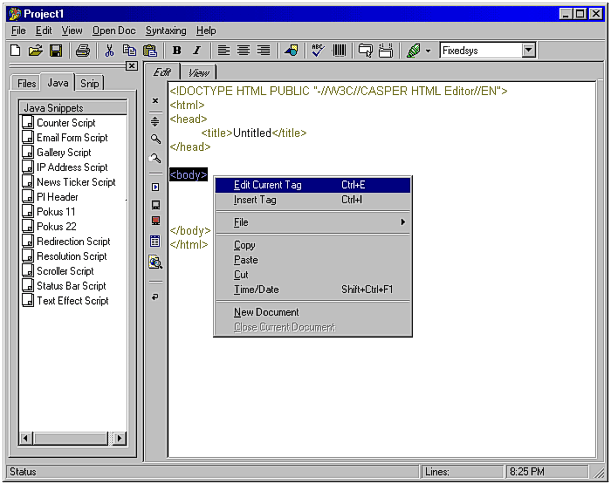



## Advanced HTML Editor  \*\*\*Update \*\*\*

### Description

Well,   Casper HTML was one of mine first big application, which at the

time had many not-quite working functions, but since then I have recoded

the whole thing from scrach and now it looks and works almost fine.

There is two or three things that needs to be fixed and I'll fix them

in the next release.

Some of the functions are: Real time TAG editing, Insert TAG function,

syntax coloring, initial pop-up (needs fix), Java and HTML snippets library,

real time view, special characters, txt files conversion, recent files and more ...

Hope you'll like it.
 
### More Info
 

             |
---                |---
**Submitted On**   |2000-07-30 20:34:30
**By**             |[Vladimir S\. Pekulas](https://github.com/Planet-Source-Code/PSCIndex/blob/master/ByAuthor/vladimir-s-pekulas.md)
**Level**          |Intermediate
**User Rating**    |4.8 (120 globes from 25 users)
**Compatibility**  |VB 6\.0
**Category**       |[Complete Applications](https://github.com/Planet-Source-Code/PSCIndex/blob/master/ByCategory/complete-applications__1-27.md)
**World**          |[Visual Basic](https://github.com/Planet-Source-Code/PSCIndex/blob/master/ByWorld/visual-basic.md)
**Archive File**   |[CODE\_UPLOAD84037302000\.zip](https://github.com/Planet-Source-Code/vladimir-s-pekulas-advanced-html-editor-update__1-10228/archive/master.zip)

